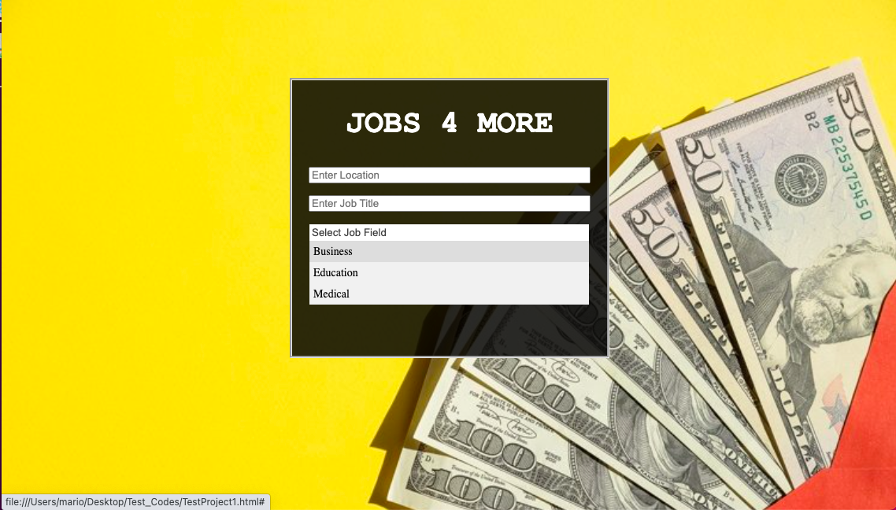
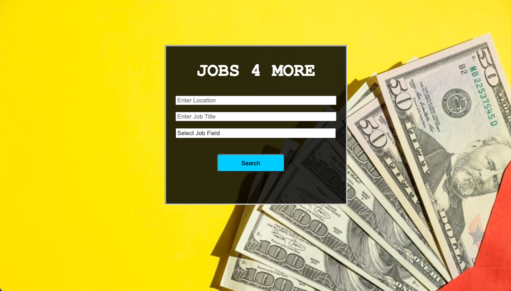

# <JOBS-4-MORE>
## Description
* As a consumer 
* I want to find a job type in a certain location
* So that I can find a job where I want to live
## Table of Contents (Optional)
- [Installation](#installation)
- [Usage](#usage)
- [Credits](#credits)
- [License](#license)
## Installation
## Usage
[JOBS 4 MORE Respostion](https://github.com/matthewjflanagan/JOBS-4-MORE)
https://matthewjflanagan.github.io/JOBS-4-MORE/
Acceptance Criteria: 
* WHEN I open the website 
* THEN I see a search bar with a dropdown menu of different job types
* WHEN I click on a category
* THEN I can use the search bar to view a list of jobs in a certain location 

## Credits
## License
MIT License
Copyright (c) [2021] [matthewflanagan]
Permission is hereby granted, free of charge, to any person obtaining a copy
of this software and associated documentation files (the "Software"), to deal
in the Software without restriction, including without limitation the rights
to use, copy, modify, merge, publish, distribute, sublicense, and/or sell
copies of the Software, and to permit persons to whom the Software is
furnished to do so, subject to the following conditions:
The above copyright notice and this permission notice shall be included in all
copies or substantial portions of the Software.
THE SOFTWARE IS PROVIDED "AS IS", WITHOUT WARRANTY OF ANY KIND, EXPRESS OR
IMPLIED, INCLUDING BUT NOT LIMITED TO THE WARRANTIES OF MERCHANTABILITY,
FITNESS FOR A PARTICULAR PURPOSE AND NONINFRINGEMENT. IN NO EVENT SHALL THE
AUTHORS OR COPYRIGHT HOLDERS BE LIABLE FOR ANY CLAIM, DAMAGES OR OTHER
LIABILITY, WHETHER IN AN ACTION OF CONTRACT, TORT OR OTHERWISE, ARISING FROM,
OUT OF OR IN CONNECTION WITH THE SOFTWARE OR THE USE OR OTHER DEALINGS IN THE
SOFTWARE.
## Features

## How to Contribute
If you created an application or package and would like other developers to contribute it, you can include guidelines for how to do so. The [Contributor Covenant](https://www.contributor-covenant.org/) is an industry standard, but you can always write your own if you'd prefer.
matthewjflanagan/JOBS-4-MORE
Stars
1
Language
HTML
Added by GitHub

